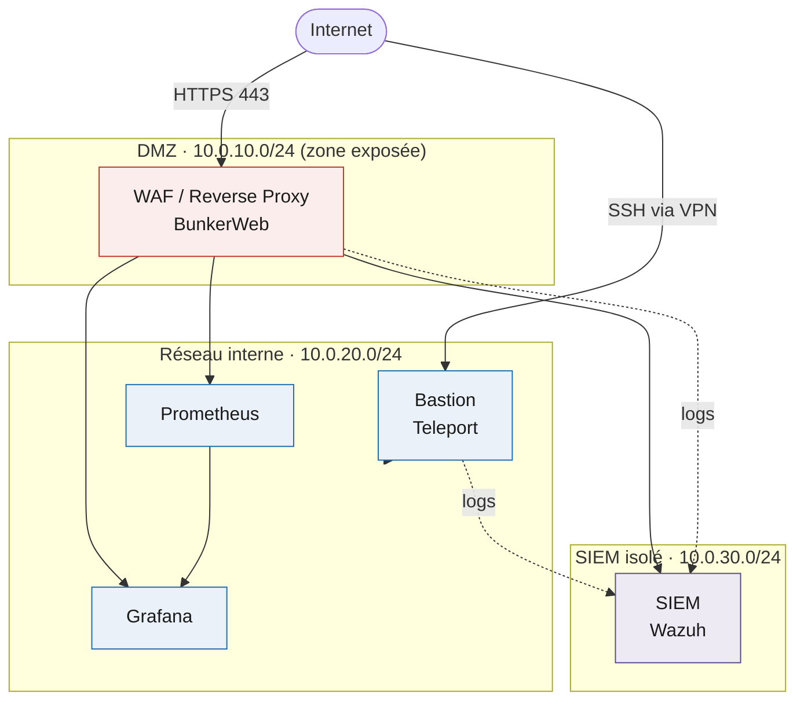
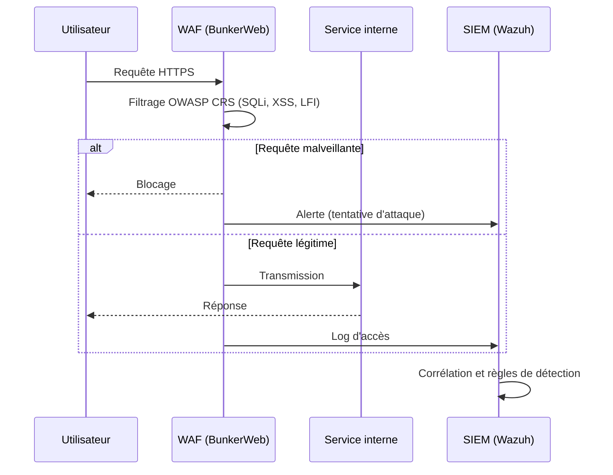

# Blue Team Home Lab

Reproduction d'une infrastructure de sécurité et de supervision de type Zero Trust dans un home lab. L'objectif est de mettre en pratique le déploiement d'un WAF, d'un SIEM, d'un bastion d'accès et d'une stack de supervision, et de comprendre comment ces briques s'articulent.

> Toutes les adresses IP et noms de domaine de ce dépôt sont des exemples. Aucune configuration ne correspond à une infrastructure réelle. C'est un lab pédagogique monté sur des machines virtuelles.

## Architecture réseau

Principe : toute entrée passe soit par le WAF en HTTPS, soit par le bastion en SSH. La DMZ est la seule zone exposée. Le SIEM est le réseau le plus isolé, car c'est lui qui détient les preuves.

## Flux d'une requête et d'une détection

## Briques déployées

| Rôle | Outil | Réseau (exemple) |
|------|-------|------------------|
| WAF / reverse proxy | BunkerWeb | DMZ |
| Bastion d'accès | Teleport | interne |
| SIEM / détection | Wazuh | isolé |
| Métriques | Prometheus | interne |
| Dashboards | Grafana | interne |
| VPN mesh | Tailscale | overlay |

## Contenu du dépôt

- **waf/** : configuration du WAF (reverse proxy multi-services, mode détection puis blocage)
- **siem/** : règles de détection et sources de logs surveillées
- **bastion/** : principes de l'accès distant sécurisé (sessions enregistrées, certificats éphémères)
- **monitoring/** : configuration Prometheus et dashboards Grafana
- **docs/** : notes d'architecture et démarche

## Compétences illustrées

Sécurité périmétrique (WAF, reverse proxy, bastion), segmentation réseau, supervision et détection via SIEM, tableaux de bord et alerting, démarche Zero Trust.

## Avertissement

Configurations d'exemple à but pédagogique. Les valeurs (IP, domaines, règles) sont génériques et doivent être adaptées et durcies pour tout usage réel.
