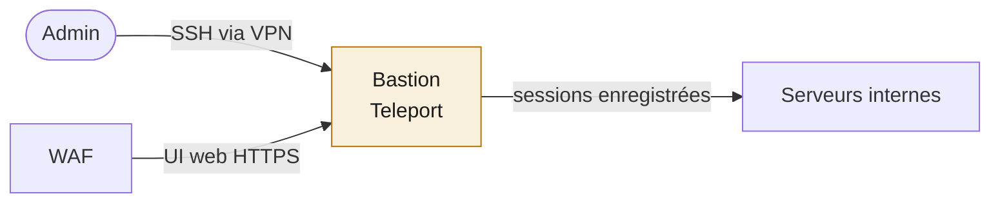

# Bastion d'accès (Teleport)

Point d'accès unique et sécurisé aux serveurs. Remplace les accès SSH directs. Son interface web est exposée via le WAF, tandis que l'accès SSH se fait à travers le VPN.

## Deux voies d'accès

## Principes

- Toutes les sessions administrateur sont enregistrées (traçabilité complète)
- Authentification par certificats éphémères (pas de clés statiques qui traînent)
- Plus aucun accès direct aux serveurs : tout passe par le bastion
- Couplé à un VPN mesh (Tailscale) pour l'accès distant

## Intérêt sécurité

- Traçabilité : on sait qui a fait quoi, quand, sur quel serveur
- Surface d'attaque réduite : un seul point d'entrée durci au lieu de N accès SSH
- Révocation centralisée : couper un accès se fait en un endroit
- Les certificats éphémères évitent les clés qui fuitent et restent valables

## Points d'attention

- Surveiller les faux positifs côté SIEM générés par l'activité normale du bastion
- Bien cloisonner les rôles (qui peut accéder à quels serveurs)# Bastion d'accès (Teleport)

Point d'accès unique et sécurisé aux serveurs. Remplace les accès SSH directs.

## Principes

- Toutes les sessions administrateur sont enregistrées
- Authentification par certificats éphémères (pas de clés statiques qui traînent)
- Plus aucun accès direct aux serveurs : tout passe par le bastion
- Couplé à un VPN mesh (Tailscale) pour l'accès distant

## Intérêt sécurité

- Traçabilité complète de qui fait quoi sur les serveurs
- Réduction de la surface d'attaque (un seul point d'entrée durci)
- Révocation d'accès simple et centralisée
