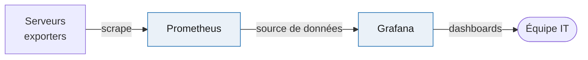

# Supervision (Prometheus + Grafana)

Collecte de métriques système et visualisation centralisée. Les deux outils partagent le même réseau de supervision.

## Chaîne de supervision

## Rôles

- **Prometheus** : collecte les métriques (CPU, mémoire, disponibilité des services) en interrogeant des exporters
- **Grafana** : utilise Prometheus comme source de données et affiche des tableaux de bord unifiés

## Exemples d'indicateurs suivis

| Indicateur | Intérêt |
|------------|---------|
| Disponibilité des services | Détecter une panne rapidement |
| Charge CPU / mémoire | Anticiper la saturation |
| Temps de détection d'incident | Mesurer l'efficacité du SIEM |
| Taux d'alertes pertinentes | Suivre la qualité de la détection |

## Intérêt

Les dashboards donnent une vue d'ensemble en temps réel et permettent de justifier les actions de sécurité par des chiffres concrets, utile pour communiquer avec des non-techniques.
