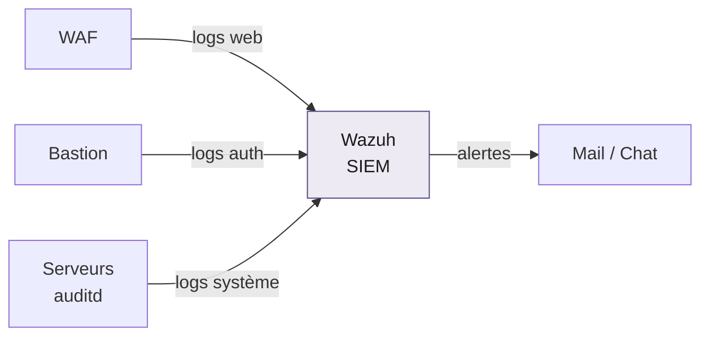

# SIEM / Détection (Wazuh)

Collecte et corrélation des logs, détection d'intrusion, alerting. Le SIEM est placé sur le réseau le plus isolé du lab, car il centralise les preuves.

## Flux de collecte

## Sources de logs surveillées

- Logs du WAF (tentatives d'attaque web)
- Logs d'authentification du bastion
- Logs système des serveurs (auditd)
- Logs réseau et équipements

## Exemples de règles de détection

| Règle | Déclencheur |
|-------|-------------|
| Brute force | Plus de 5 échecs d'authentification en 10 minutes |
| Accès anormal | Connexion SSH/RDP depuis Internet hors accès légitime |
| Scan de ports | Nombreuses tentatives vers des ports fermés |
| Horaire suspect | Connexion administrateur hors horaires de bureau |
| Trafic malveillant | Connexion vers des IP répertoriées C2 ou TOR |

## Démarche de déploiement

1. Mode audit : on observe le trafic légitime sans alerter
2. Mode détection : génération d'alertes sans blocage
3. Affinage : réduction des faux positifs pour ne garder que les alertes pertinentes
4. Alerting : remontée des alertes critiques par mail et messagerie# SIEM / Détection (Wazuh)

Collecte et corrélation des logs, détection d'intrusion, alerting. Le SIEM est placé sur le réseau le plus isolé du lab.

## Sources de logs surveillées

- Logs du WAF (tentatives d'attaque web)
- Logs d'authentification du bastion
- Logs système des serveurs (auditd)
- Logs réseau

## Exemples de règles de détection

- Plus de 5 échecs d'authentification en 10 minutes
- Connexion SSH/RDP depuis Internet hors accès légitime
- Scan de ports (nombreuses tentatives vers des ports fermés)
- Connexion administrateur hors horaires de bureau
- Trafic vers des IP répertoriées C2 ou TOR

## Démarche

Déploiement progressif : d'abord en mode audit (on observe le trafic légitime), puis génération d'alertes sans blocage, puis réduction des faux positifs pour ne garder que les alertes pertinentes.
