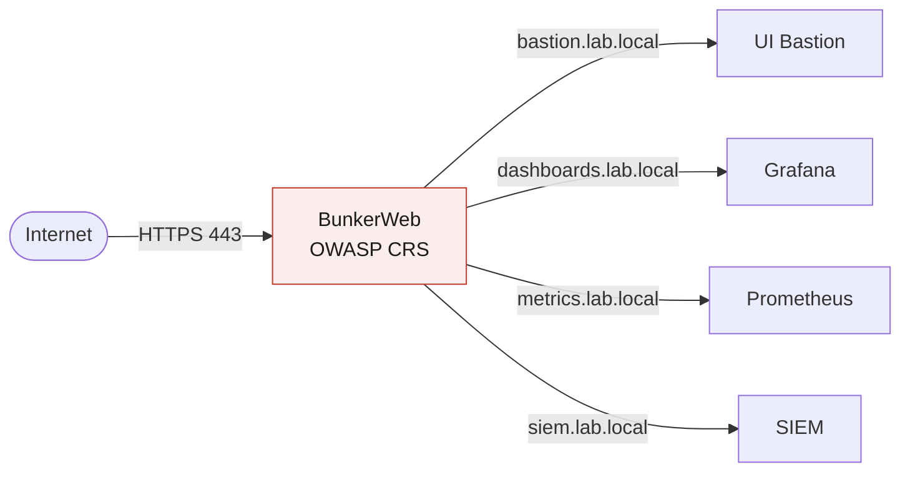

# WAF / Reverse Proxy (BunkerWeb)

Un WAF open source basé sur nginx, configuré par variables d'environnement. Une seule instance protège plusieurs services, chacun avec sa propre politique. C'est l'unique point d'entrée web de l'infrastructure.

## Rôle dans l'architecture

## Principe

- Intègre l'OWASP Core Rule Set (SQLi, XSS, LFI) pour filtrer le trafic malveillant
- Déployé en DMZ comme unique point d'entrée HTTPS
- Multi-services : un domaine par service interne, avec des politiques indépendantes
- Approche progressive : mode détection d'abord (on observe), puis mode blocage (on filtre)

## Politiques par service (exemples génériques)

| Domaine (exemple)    | Service cible   | Politique appliquée        |
|----------------------|-----------------|----------------------------|
| bastion.lab.local    | UI du bastion   | CORS désactivé             |
| dashboards.lab.local | Grafana         | Liste blanche IP interne   |
| metrics.lab.local    | Prometheus      | Limitation de débit        |
| siem.lab.local       | SIEM            | Ban temporaire si suspect  |

## Bonnes pratiques appliquées

- Aucun accès direct aux services internes depuis Internet
- Seul le HTTPS (443) est autorisé vers le reverse proxy
- Journalisation de tout le trafic vers le SIEM
- Configuration déclarative (versionnable, reproductible)

## Points d'attention

- Bien passer en mode blocage seulement après une phase d'observation, pour ne pas casser le trafic légitime
- Adapter les règles OWASP au comportement réel des applications (réduction des faux positifs)
